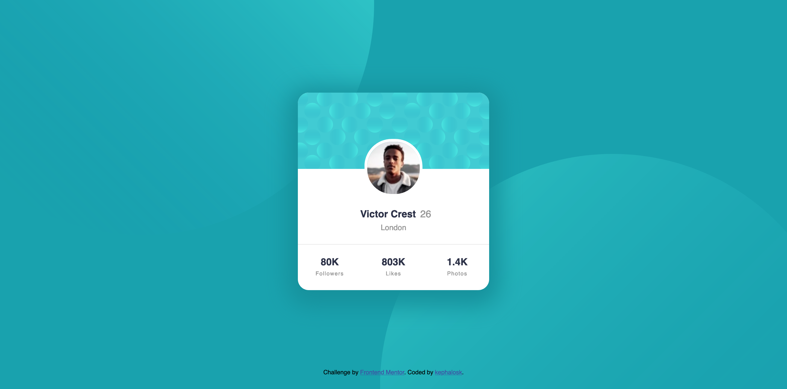
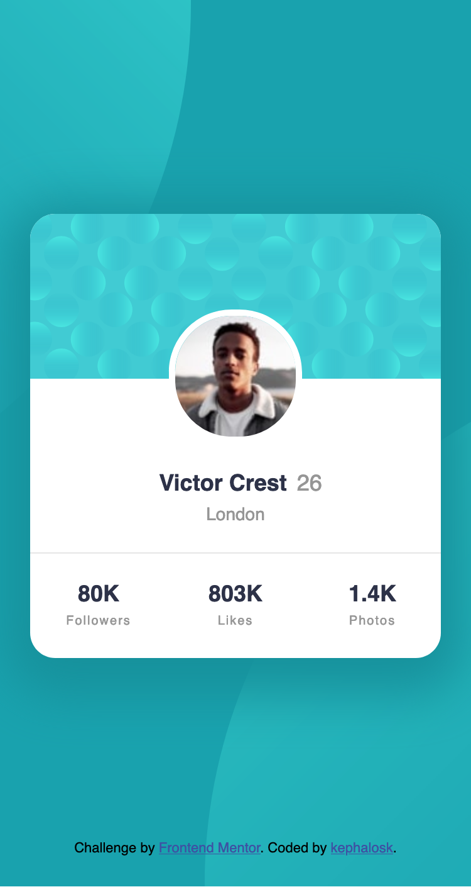

# Frontend Mentor - Social links profile solution

This is a solution to the [Blog preview card challenge on Frontend Mentor](https://www.frontendmentor.io/challenges/blog-preview-card-ckPaj01IcS/hub). Frontend Mentor challenges help you improve your coding skills by building realistic projects. 

## Table of contents

- [Overview](#overview)
  - [Screenshot](#screenshot)
  - [Links](#links)
- [My process](#my-process)
  - [Built with](#built-with)
  - [What I learned](#what-i-learned)
  - [Continued development](#continued-development)
  - [Useful resources](#useful-resources)
- [Author](#author)
- [Acknowledgments](#acknowledgments)


## Overview

### Screenshot

Desktop


Mobile


### Links

- Solution URL: [Add solution URL here](https://github.com/kephalosk/profile-card-component)
- Live Site URL: [Add live site URL here](https://kephalosk.github.io/profile-card-component/)

## My process

1. download Project


2. move Project to target folder


3. open Project in IDE


4. read README


5. add .gitignore-file


6. check files


7. check design


8. initialize repo
* create repo on GitHub
* git init
* git add .
* git commit -m "initial commit"
* git remote add origin git@github.com:kephalosk/${projectname}.git
* git push -u origin master

9. check html
* build general structure
* open index.html in browser for comparison

10. check css
* image styling
* font styling
* color styling
* frame styling
* spacing styling

11. check transitions


12. check mobile/responsive design


13. check accessability
* semantic html
* headings
* alternative texts
* language
* clear language
* link texts

14. extract css


15. add screenshots


16. update README


17. publish website

### Built with

- Semantic HTML5 markup
- CSS custom properties
- Desktop-first workflow

### What I learned

I learned to put multiple images in the background
```css
body {
  align-items: center;
  background-color: hsl(185, 75%, 39%);
  background-image: url('images/bg-pattern-top.svg'), url('images/bg-pattern-bottom.svg');
  background-size: 850px, 850px;
  background-position: calc(50% - 460px) calc(50% - 350px), calc(50% + 400px) calc(50% + 350px);
  background-repeat: no-repeat;
  display: flex;
  flex-direction: column;
  font-family: "Kumbh Sans",sans-serif;
  justify-content: center;
  margin: 24px;
}
```

I learned to position an overlay relativ to its parent component
```css
.profileCardContent {
  position: relative;
  width: 100%;
}

.profileCardPicture {
  position: absolute;
  top: 0%;
  left: 50%;
  transform: translate(-50%, -50%);
  color: white;
  padding: 20px 0;
  border-radius: 10px;
  z-index: 1;
  text-align: center;
}
```

### Continued development

* improve html
* improve css

### Useful resources

- [w3schools](https://www.w3schools.com/) - HTML and CSS knowledge
- [selfhtml](https://wiki.selfhtml.org/wiki/HTML) - HTML knowledge

## Author

- Website - [kephalosk](https://easywebpath.com)
- Frontend Mentor - [@yourusername](https://www.frontendmentor.io/profile/yourusername)
- Twitter - [@yourusername](https://www.twitter.com/yourusername)

## Acknowledgments

None.